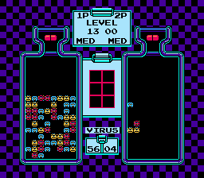
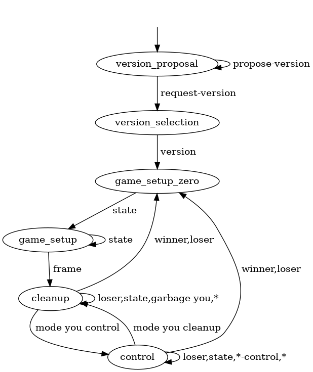

# Dr. Mario Server/Client Protocol

## Purpose

The Dr. Mario Server/Client Protocol is an application-level protocol for
hosting and playing games of
[Dr. Mario](https://en.wikipedia.org/wiki/Dr._Mario), a real-time puzzle game.
This document describes a simple architecture in which there is a single
server, which serves as a game host that coordinates multiple players, and
multiple clients, which serve as players and may be backed for example by human
inputs or an artificial intelligence. The protocol describes a suitable wire
format for sending logical game events from the server to the clients and for
sending control inputs from the clients to the server.

The protocol attempts to balance two conflicting goals of information density
and robustness. On the one hand, publishing changes to the game state is very
space-efficient; on the other hand, independent implementations of Dr. Mario
likely have independent bugs, and occasional transfers of the full game state
can help re-synch and recover.

## Overview and Examples

The protocol begins with a protocol version negotiation, to ensure that the
server and client are speaking the same language. The server sends the client a
list of versions it is willing to speak, in preference order (most preferred
first), then the client selects a version and replies (or ends the
interaction). For example, this negotiation might look like this:

    > propose-version 1.0.2
    > propose-version 1.0.0
    > propose-version 0.9.1
    > propose-version 0.9.0
    > request-version
    < version 1.0.0

In this example, and others in this document, the prefix <code>> </code>
indicates a message sent from the server to the client, and <code>< </code>
indicates a message sent from the client to the server. These marks are not
actually part of the messages.

After the version negotiation, the server announces the number of players.
Currently this phase is purely informational, and there is no negotiation of
player count, difficulty settings, or play speed. If negotiation is desired, it
must be done out-of-band. Future versions of the protocol may make this more
interactive if the need for this capability becomes clear, but the current
design focuses on simplicity instead. For example:

    > players 2

Then the game begins. The server announces the initial game state in a series
of messages. Each message has a player identifier, a drop speed, a two-byte
"next pill" indicator, and a 128-byte board setup. The special player
identifier `you` is always used for whichever client is currently getting
messages. The drop speed indicates how many frames can pass without downward
motion before a pill is forced to drop one row. For the next pill indicator and
the board setup, the bottom two bits of each byte indicate a color: 0 for
empty, 1 for red, 2 for yellow, 3 for blue. The next three bits indicate a
shape: 0 for virus, 1 for a disconnected pill half, 2 for a pill half that
connects up, 3 for connected down, 4 for connected right, 5 for connected left.
The top three bits are 011, so that valid bytes fall in the latin-1 range
`a`-`w`. Empty cells always use the exact bit pattern 01100100 (`d`). For
example, consider this initial state:

The player on the left will receive these messages:

    > state you 19 qu ddddddddddddddddddddddddddddddddddddddddddddddddbcaacbbcbbddbdccaacbadcdaacdacbbdbdcddbaccbaddcaddcdbbaddbaccbaccbacdacbdacddddd cleanup
    > state opponent 19 qu ddddddddddddddddddddddddddddddddddddddddddddddddddddddddcddddddddddddddddddddddddaddddddbbdddddddddddddddddddddddddddddddddddddd cleanup

The attentive reader may wonder about the "cleanup" at the end of these `state`
messages. The game can be in two modes: `control` or `cleanup`. In the control
mode, there is a free-floating pill under the player's control. When the pill
locks, there is a cleanup phase during which four-in-a-rows are cleared and
gravity is applied to unsupported pieces. The control mode comes with slightly
more data: how many frames are left before the free-floating piece is forced to
drop one row, the shape and colors of the free-floating piece, plus the x and y
position of the bottom left corner of the piece.

The client may request a full state update at any time with the `request-state`
message. The server will respond with the full state on the next frame; or the
client may request an update at a specific future frame or at the edge of a
mode change. Out-of-date state requests are rejected with `old-state`, and
requests for the far future are rejected with `far-state`. For example:

    > frame 538
    < request-state
    > frame 539
    > state you 19 qu ddddddddddddddddddddddddddddddddddddddddddddddddbcaacbbcbbddbdccaacbadcdaacdacbbdbdcddbaccbaddcaddcdbbaddbaccbaccbacdacbdacddddd cleanup
    > state opponent 19 qu ddddddddddddddddddddddddddddddddddddddddddddddddddddddddcddddddddddddddddddddddddaddddddbbdddddddddddddddddddddddddddddddddddddd cleanup
    < request-state 540
    > frame 540
    > state you 19 qu ddddddddddddddddddddddddddddddddddddddddddddddddbcaacbbcbbddbdccaacbadcdaacdacbbdbdcddbaccbaddcaddcdbbaddbaccbaccbacdacbdacddddd cleanup
    > state opponent 19 qu ddddddddddddddddddddddddddddddddddddddddddddddddddddddddcddddddddddddddddddddddddaddddddbbdddddddddddddddddddddddddddddddddddddd cleanup
    < request-state 539
    > old-state 539
    < request-state 10000
    > far-state 10000
    < request-state control
    > frame 545
    > mode you control rw
    > state you 19 rw ddddddddddddddddddddddddddddddddddddddddddddddddbcaacbbcbbddbdccaacbadcdaacdacbbdbdcddbaccbaddcaddcdbbaddbaccbaccbacdacbdacddddd control 19 qu 3 15
    > state opponent 19 rw ddddddddddddddddddddddddddddddddddddddddddddddddddddddddcddddddddddddddddddddddddaddddddbbdddddddddddddddddddddddddddddddddddddd control 19 qu 3 15

Clients can control their falling pill with the `queue` and `control` messages.
The `queue` message specifies a sequence of button presses to initiate next
time the game enters control mode, while the `control` message specifies a
sequence of button presses while in control mode. Buttons are specified as `l`,
`r`, `d`, `a`, or `b` (for left, right, down, rotate clockwise, and rotate
counterclockwise, respectively). By default they toggle the button state, but
an optional `+` modifier prefix means "transition to pressed" while an optional
`-` modifier prefix means "transition to unpressed". The specified button
presses are executed one per frame; multiple presses can be grouped together
into a single frame with parentheses. Recall the game state from earlier:

The left player might transmit this message to put the red pill on top of the
leftmost, uppermost red virus:

    < queue deadbeef (la)(la)dddddddddddd
    > accept-queue deadbeef
    > frame 545
    > mode you control rw

Here `deadbeef` is an arbitrary identifier chosen by the client that can be
used to connect an `accept-queue` message with the `queue` message it is
responding to.

After some time, the client may decide that placing the pill horizontally
instead may be a better move. Since control mode has already begun, the client
must now use the `control` message to modify the sequence of button presses.
This message takes an additional frame argument on which the transition from
the old sequence to the new one should be done. The server then agrees or
complains that the given frame has already passed or is too far in the future.

    < control cafebabe 545 lldddddddddddd
    > old-control cafebabe
    < control badfood 10000 dddddd
    > far-control badfood
    < control lessfilling 549 aadddddddddd
    > accept-control lessfilling

The server always has exactly one sequence of presses (possibly empty) queued
for the next control mode and at most one sequence of presses currently
executing; the `queue` and `control` messages, when successful, overwrite any
existing sequences. When control mode ends, all buttons are released and any
pending presses are silently discarded.

As the game progresses, the server announces certain events with the `frame`,
`pill`, `garbage`, `speed`, and `mode` messages. With the exception of `frame`,
all of these messages include a player identifier. The server sends one `frame`
message every frame (60 times per second if the server is running at realtime
speed); we have seen several examples of this already.

The `pill` message indicates a new position and orientation for the given
player's pill by giving the x and y coordinates of the bottom left of the pill,
together with two bytes indicating the pill shape. For example, after the above
`queue` and `control` commands, we can expect to see

    > frame 558
    > pill you 2 10 qu

to indicate that the pill is currently horizontal, still double-red, and
positioned just above the topmost two red viruses.

The `garbage` message can only occur in multi-player games during the cleanup
mode, and indicates that the given player is about to have garbage dropped on
them because their opponent made a combo. The message includes the columns
where the garbage will appear and the pieces that will be placed there. For
example,

    > garbage opponent 036 eeg

indicates that the opponent is getting red garbage in the leftmost column, red
about halfway through, and blue in the second from the right. If you are
receiving garbage, this might be a good time to `queue` an empty sequence of
button presses until you figure out how the garbage changes your plan!

The `mode` message indicates a transition between modes; the player identifier
will be followed by one of the strings `cleanup` or `control`, and a
declaration of the next pill colors if the string is `control`. The `speed`
message indicates when the given player's pills have sped up, and gives the
number of frames a pill can maneuver before it is forced to drop one row. So,

    > speed you 16

indicates that you now have 16 frames of maneuvering time per row.

Occasionally it is convenient for the client to display some debugging
information directly on the board. For this purpose there is a `debug` message.
It is purely informational: servers are not required to do anything special
when they see this message. The format of the message is a sequence of x, y,
and piece triples; a friendly server might choose to overlay a translucent
version of these over the actual game board. For example, for our running
example initial state,

    < debug 2 10 q 3 10 u 2 10 r 2 11 w

would be a good way to indicate that the client was considering placing the
first double-red pill either horizontally above the two topmost red viruses or
vertically above the left-most of those viruses. Conflicting triples, like the
two competing shapes given for position (2,10) in the above message, are
expressly allowed. Each `debug` message completely replaces the previous one.
Consequently the debugging information can be cleared by sending a message with
an empty sequence of triples, as in:

    < debug

If a player fills their bottle, the server sends a `loser` message with that
player's identifier. If a player clears all of their viruses, the server sends
a `winner` message with that player's identifier. The server may then begin the
protocol anew from the `player-count` message or from a complete, fresh initial
game state, at its pleasure. The difficulty and speed settings are preserved,
except that in single-player games the difficulty setting is increased by one
after a `winner` message. For example, the server might send the following for
a rematch:

    > winner opponent
    > frame 4102
    > state you 19 qu ddddddddddddddddddddddddddddddddddddddddddddddddbcaacbbcbbddbdccaacbadcdaacdacbbdbdcddbaccbaddcaddcdbbaddbaccbaccbacdacbdacddddd cleanup
    > state opponent 19 qu ddddddddddddddddddddddddddddddddddddddddddddddddddddddddcddddddddddddddddddddddddaddddddbbdddddddddddddddddddddddddddddddddddddd cleanup

Or the messages might look like this for a complete restart:

    > winner opponent
    > players 1

## Conventions

This is a byte-oriented protocol; byte strings are well supported in most
programming languages and are conveniently transmitted in many communication
protocols (e.g. on a network, a socket, or via a pipe). For presentational
convenience, these bytes are frequently presented in this document as text. Use
the latin-1 encoding to convert from text given in this document to bytes. Text
which should be so converted is given in `monospace`.

Messages are terminated by exactly one 10 byte (newline), called a *message
separator*. Message components are separated by exactly one 32 byte (space),
called a *component separator*. All messages begin with a verb and may have
several components afterwards, each prefixed by a component separator. The
components associated with each verb are described in the "Message reference"
section.

The version negotiation protocol is intended to be stable across versions, so
that it makes sense to participate in this negotiation even when there is no
version of the protocol that both the server and client can understand. All
other messages&mdash;and even the structure of messages described
above&mdash;are subject to radical modification in future versions of the
protocol. This document describes version `0-statefix` of the protocol.

As mentioned in the overview, this document contains many example exchanges
between a hypothetical server and client. These exchanges are prefaced by
<code>> </code> to indicate that the message was sent from the server to the
client or by <code>< </code> to indicate that the message was sent from the
client to the server. In both cases, the two bytes indicating directionality
are not a part of the message; they are only a part of this document's
presentation.

An *application* is either a server or a client.

An *identifier* is any sequence of up to 40 bytes that do not contain a
component separator or message separator. Empty identifiers are allowed. A
*player identifier* is an identifier, with the caveat that the special
identifier `you` is always used for the player associated with the client
receiving the message.

An *integer* is a non-empty sequence of decimal digits (bytes 48-57) that

* is either exactly the string `0` or does not begin with `0`, AND
* falls in the range 0-2147483647 (2^32-1) when decoded.

The decoding is done in the obvious way.

A *position* is two integers separated by a component separator. The first
integer is an x coordinate, with 0 being the leftmost column and 7 being the
rightmost. The second integer is a y coordinate, with 0 being the bottom row
and 15 being the top. It is not valid to have x coordinates 8 or higher or y
coordinates 16 or higher.

A *button* is one of `l`, `r`, `d`, `a`, or `b`. These correspond to the left,
right, down, A (clockwise rotation), and B (counterclockwise rotation) switches
on a standard game system controller. These switches are open when the player
is not touching the controller.

An *atomic button press* is an optional `+` or `-` followed by a button. If no
prefix is present, this indicates a toggle; the `+` prefix indicates that the
switch should be closed (changing nothing if the switch was already closed);
and the `-` prefix indicates that the switch should be opened (changing nothing
if the switch was already open).

A *button press* is either

* an atomic button press, OR
* a `(`, a sequence of atomic button presses in which no button occurs twice,
  and a `)`.

Empty sequences are allowed, so `()` is a valid button press (indicating that
the state of the switches should not change).

A *cell* is one of the bytes in the range `a` to `w` inclusive that is not `h`,
`l`, `p`, or `t`. The two least significant bits indicate a color and the next
three bits indicate a shape, as given in the tables below.

| b & 0b00000011 | color |
| -------------- | ----- |
| 0 | black/empty |
| 1 | red |
| 2 | yellow |
| 3 | blue |

| b & 0b00011100 | shape |
| -------------- | ----- |
| 0 | virus |
| 4 | disconnected pill half |
| 8 | bottom half of a vertical pill |
| 12 | top half of a vertical pill |
| 16 | left half of a horizontal pill |
| 20 | right half of a horizontal pill |

A *pill* is a sequence of 2 cells whose shape bits are 8 and 12, respectively,
or 16 and 20, respectively. When associated with a position, the first cell is
in that position. The second cell is to the right of the first if the shape
bits are for a horizontal pill or above the first if the shape bits are for a
vertical pill.

A *board* is a sequence of 128 cells. It describes an 8x16 area in row-major
order, top left to bottom right.

To bound the amount of state the server needs to store, there are some limits
in place:

* Button press sequences are limited to 624 frames in duration. (The slowest
  achievable drop speed is one row every 39 frames, and there are 16 rows, so
  this should be sufficient to cover all interesting maneuvers anyway.)
  Button press sequences longer than this MAY be silently truncated by the
  server. (Button press sequences shorter than 624 frames MUST NOT be
  truncated.)
* Requests referencing a frame 300 frames or more in the future MAY be
  rejected; if they are, the server MUST use the appropriate message to inform
  the client. (Requests referencing a frame at least 1 and less than 300 frames
  in the future MUST be accepted.)
* Messages are limited to 8192 bytes, including the mandatory message
  separator. This should only really matter for the `debug` message, as it is
  the only truly variable-length message, but 8K ought to be enough for
  anybody. Of the remaining messages, `control` and `queue` have the worst-case
  length that comes closest to this limit; the longest button press is
  `(+l+r+d+a+b)`, 12 bytes long; 624 of these would be 7488 bytes, so 8192
  bytes is sufficient to contain this and the other message material. Servers
  MAY silently ignore messages longer than 8192 bytes. Servers MAY silently
  truncate messages longer than 8192 bytes; if they do so, they MUST truncate
  the message in a way that leaves it as a valid message and MUST NOT truncate
  the message any shorter than the longest valid message in the first 8192
  bytes. Clients do not have this problem, as all server messages are short.
  (Messages 8192 bytes long or shorter MUST NOT be truncated.)

Messages (and applications which send messages) violating these limits are
allowed by the protocol; the above discussion affects only their
interpretation, not their validity.

## Control flow

The flow of the protocol is pictured below.

Nodes are labeled by a mnemonic for the protocol state; the "Message reference"
section uses these mnemonics to organize the discussion of messages. In each
state, only some messages are valid; and when a message is emitted, it triggers
a state transition. The edges in the diagram above indicate which messages are
valid and what state transition they cause. The special label "\*-control"
stands for the messages `control`, `accept-control`, `far-control`, and
`old-control`. The special label "\*" stands for all the messages not otherwise
mentioned in the diagram: `debug`, `queue`, and `request-state` for clients,
and `accept-queue`, `speed`, `far-state`, `frame`, `garbage` with a non-`you`
identifier, `mode` with a non-`you` identifier, `old-state`, and `pill` for
servers.

The diagram may appear to be nondeterministic at first; for example, the
game\_setup state has two outgoing edges labeled `state`. However, the client
and server can always agree on which of multiple possible outgoing edges is
being taken. This requires the use of some additional state; it is not shown in
the above diagram because it would cause it to be needlessly complex. The
details of which edge to take are discussed in the appropriate message
reference in the "Message reference" section.

Additionally, as a practical matter, the server and client can briefly disagree
on which state the protocol is in (for example, after the server has emitted a
`mode` message but before the client has processed it). For this reason, some
client messages are allowed "one state late"; servers silently drop these late
messages. Specifically, servers silently ignore `control` messages in the
cleanup state and `control`, `debug`, `queue`, and `request-state` messages in
the game\_setup state.

The server has some state for each player: the status of each switch, queued
switch manipulations, scheduled switch manipulations (when in control mode),
outstanding state requests, and possibly some debug information. When entering
the game\_setup state, this state is notionally cleared: the switches are reset
to open, queued and scheduled switch manipulations are silently discarded,
outstanding state requests are silently dropped, and debug information is
cleared. When entering the cleanup state, only part of the state is cleared:
the switches are reset to open, and scheduled switch manipulations are silently
discarded.

## Message reference

In this section, we give a detailed description of each verb, organized by
what protocol states a message with that verb is allowed to be emitted in.
Within each state, server verbs appear first in alphabetical order, then client
verbs in alphabetical order. Each verb is accompanied by an indicator of
whether such messages should originate from the server (S) or the client (C), a
collection of formats that can be instantiated to form a message, the state
transition caused by messages with that verb, and a short description of the
effect of the message and any restrictions on valid instantiations. In the
message formats, sequences enclosed by angle brackets should be replaced by
appropriately formatted sequences as described in the "Conventions" section or
immediately following the instantiation format. For example, the format

    players <integer>

indicates that valid messages for this verb are `players `, then a non-empty
sequence of digits as described by the term "integer" in the "Conventions"
section, then a message separator.

All messages begin with a verb and are terminated by exactly one message
separator.

This document does not attempt to describe how the board state of the game
evolves on a frame-by-frame basis. The full details are much too complicated.
The short answer is "whatever Dr. Mario on the NES does", bugs and all. It is
admittedly very difficult to tell whether a given server implementation
conforms to this specification...

### version\_proposal state

#### propose-version (S)

    propose-version <identifier>

Landing state: version\_proposal

Informs the client that the server is willing to speak the protocol version
specified by the given identifier. When proposing multiple versions, propose
more preferred versions before less preferred ones.

#### request-version (S)

    request-version

Landing state: version\_selection

Informs the client that the server has finished listing protocol versions it is
willing to speak. The client will now select one of these versions.

### version\_selection state

#### version (C)

    version <identifier>

Landing state: match\_setup

Selects a protocol version for the server and client to speak with each other.
The client MUST use one of the identifiers sent by the server in a previous
`propose-version` message. If the client cannot speak any of the proposed
versions, it MUST NOT send any further messages.

This message ends the version negotiation part of the protocol, which is the
part of the protocol that is intended to be stable across versions.

### match\_setup and game\_setup states

#### players (S)

    players <integer>

Landing state: game\_setup

The given integer must be at least 1, and indicates how many distinct player
identifiers there will be in future messages. Any information the client was
storing about players is invalidated by this message and can be thrown away.

#### state (S)

    state <player identifier> <integer> <pill> <board> cleanup

Landing state: If the total number of unique player identifiers that have
appeared since the last `players`, `winner`, or `loser` message matches the
integer given in the last `players` message, then land in the cleanup state.
Otherwise remain in game\_setup.

(Note that there is another variant of the `state` verb which is not allowed in
this state. See the "control and cleanup states" subsection for further
details.)

This message summarizes the complete game state for one player. The integer
component indicates the drop rate for pills: the maximum number of frames that
may pass without the pill dropping one row or locking. The pill component
indicates what free-floating piece will come under the player's control when
the game mode changes. The board component gives the positions of the initial
viruses.

The player identifiers mentioned in `state` messages with no intervening
`players`, `winner`, or `loser` message form the set of valid player
identifiers to be used in future messages. This set MUST include `you`. The
server MUST NOT use any player identifiers from outside this set until it
re-enters the game\_setup state.

#### ignored verbs (C)

The following verbs are silently ignored by the server in the game\_setup
state: `control`, `debug`, `queue`, and `request-state`. See the "control and
cleanup states" subsection for the format of these messages.

### control state

Most of the verbs allowed in this state are also allowed in the cleanup state.
See the "control and cleanup states" subsection for further details on those
verbs. Here we discuss only those verbs which are special to the control state:
`control`, `accept-control`, `far-control`, and `old-control`.

`control` messages MUST be handled (accepted or rejected) by the server in the
order they were sent.

#### accept-control (S)

    accept-control <identifier>

Landing state: control

The server received a `control` message with the given identifier and applied
it. See the `control` verb specification for what this means.

#### far-control (S)

    far-control <identifier>

Landing state: control

The server rejected a `control` message with the given identifier because it
was 300 or more frames in the future.

#### old-control (S)

    old-control <identifier>

Landing state: control

The server rejected a `control` message with the given identifier because it
started at a frame in the past.

#### control (C)

    control <identifier> <integer> <sequence of button presses>

Landing state: control

Request that the server initiate the switch manipulations described by the
sequence of button presses component starting at the frame indicated by the
integer component. If the `control` message is accepted, any previously
scheduled switch manipulations for frames starting from the one given in the
message are canceled. If the `control` message is rejected, no changes to
previously scheduled switch manipulations are made.

### control and cleanup states

`queue` messages MUST be handled (accepted or rejected) by the server in the
order they were sent.

#### accept-queue (S)

    accept-queue <identifier>

Landing state: unchanged

The server received a `queue` message with the given identifier and replaced
any existing queued switch manipulations with the given ones.

#### far-state (S)

    far-state <identifier>

Landing state: unchanged

The server rejected a `request-state` message with the given identifier because
it was 300 or more frames in the future.

#### frame (S)

    frame <integer>

Landing state: unchanged

Announce that the game's frame counter has progressed to the given integer. The
frame counter MUST monotonically increase. The frame counter MUST NOT increase
by more than one unless there is an intervening change to the game\_setup
state. Any rejection messages (those with verbs `far-control`, `far-state`,
`old-control`, or `old-state`) MUST be coherent: the message they are rejecting
must refer to a frame older than the one in the most recent `frame` message for
`old-control` and `old-state` or at least 300 frames in the future from the
most recent `frame` message for `far-control` and `far-state`.

#### garbage (S)

    garbage <player identifier> <sequence of columns> <sequence of cells>

Landing state: unchanged

A *column* is a byte in the range `0` to `7` and indicates the x coordinate of
a position with y coordinate 15.

The sequence of columns component MUST NOT have any duplicate bytes. The
sequence of cells component MUST have the same number of bytes as the sequence
of columns component. The shape bits of each cell in the sequence of cells
component MUST be 4 (disconnected). Messages beginning <code>garbage you
</code> are only allowed in the cleanup state.

This message indicates that the given player is being sent garbage. The
positions indicated by the sequence of columns component are overwritten by the
cells given by the sequence of cells component in order (the first position is
overwritten by the first cell, the second position by the second cell, and so
on).

#### loser (S)

    loser <player identifier>

Landing state: If this is a single-player game, land in game\_setup. If this is
an *n*-player game and this is the *n*-1'th `loser` message since we left the
game\_setup state, land in game\_setup. Otherwise the state is unchanged.

This message indicates that the given player has lost by filling up their
bottle.

If all but one players has lost, the server discards any scheduled switch
manipulations, discards any queued switch manipulations, resets all switches to
open, discards any outstanding state requests, and discards all debug
information.

#### mode (S)

    mode <player identifier> cleanup
    mode <player identifier> control <pill>

Landing state: If the player identifier component is `you`, then cleanup for
the first variant and control for the second variant. Otherwise the state is
unchanged.

This is used to indicate when a player switches game modes. When `you` enter
`cleanup` mode, any scheduled switch manipulations are silently discarded and
all of the switches are opened. When any player enters `cleanup` mode, their
free-floating piece is "locked" and becomes a part of the board. In the second
variant, the pill message component indicates the lookahead pill that will come
under the player's control the *next* time control mode is entered (not this
time).

#### old-state (S)

    old-state <identifier>

Landing state: unchanged

The server rejected a `request-state` message with the given identifier because
it requested the state for a frame in the past.

#### pill (S)

    pill <player identifier> <position> <pill>

The free-floating piece for the indicated player has moved, rotated, or has
just appeared because control mode started, and is now in the given position
and orientation.

#### speed (S)

    speed <player identifier> <integer>

The drop speed for the indicated player has changed. The given integer
indicates how many frames may pass without downward movement before a
free-floating piece is forced to either drop one row or lock in position.

#### state (S)

    state <player identifier> <integer> <pill> <board> cleanup
    state <player identifier> <integer> <pill> <board> control <integer> <pill> <position>

Landing state: unchanged

This message summarizes the complete game state for one player. The first
integer component indicates the drop rate for free-floating pieces: the maximum
number of frames that may pass without the pill dropping one row or locking.
The first pill component indicates what free-floating piece will come under the
player's control the next time control mode begins for that player. The board
component describes the current board state.

In the second variant, the second integer component indicates the next forced
drop for the current free-floating piece: the maximum number of frames that may
pass, starting now, before the current free-floating piece is forced to drop
one row or lock. This is distinct from the first integer component; the first
indicates frames between consecutive drops, while the second indicates frames
between now and the next drop. The second pill component indicates the
free-floating piece currently under player control, and the position component
indicates the location of the bottom left corner of the free-floating piece.

If the server sends this message in response to a `request-state` message, it
MUST send one `state` message for each player who has not yet lost with no
intervening messages.

#### winner (S)

    winner <player identifier>

Landing state: game\_setup

The player indicated won by clearing all of their viruses.

Because we are now transitioning to game\_setup, the server discards any
scheduled switch manipulations, discards any queued switch manipulations,
resets all switches to open, discards any outstanding state requests, and
discards all debug information.

#### control (C)

The `control` verb is silently ignored by the server in the cleanup state. See
the "control state" subsection for the format of this message and a discussion
of what it means for the server when in the control state.

#### debug (C)

    debug<sequence of debug instructions>

Landing state: unchanged

A *debug instruction* has the form <code> \<position\> \<cell\></code>. It
indicates that the client would like to mark the given position with the
graphic for the given cell.

Note the lack of component separator in the instantiation format and the
initial component separator in the definition of a debug instruction. For
example, the bare message `debug` is valid, as is `debug 0 0 a`, but
<code>debug </code> with a trailing component separator is not a valid message,
nor is `debug0 0 a` with no intervening component separator between `debug` and
the first position.

Repeat positions are allowed.

This message is informational only: it has no effect on the evolution of the
game state. It is a declaration that the client would like to broadcast some
information. Each `debug` message completely overrides any previous `debug`
messages, and remains the debug information associated with that client until
the next `debug` message.

Servers are free to display the information provided by `debug` messages in any
way they like, including by not displaying it at all.

#### queue (C)

    queue <identifier> <sequence of button presses>

Landing state: unchanged

This message requests that the server replace whatever switch manipulations it
has in its queue with the ones in the sequence of button presses component. If
accepted, the given switch manipulations will be queued, and the next time the
server issues a `mode you control` message it will schedule the queued switch
manipulations starting on that frame.

Note that this message is allowed even when the game is in control mode; and
the meaning is as described above: any switch manipulations queued in that way
will be scheduled and start affecting the game state the *next* time the game
enters control mode (not starting now!). Use the `control` verb to modify the
scheduled switch manipulations when already in control mode.

In particular clients might want to watch out for an intervening `mode` change
between a `queue` request and the server's corresponding `accept-queue`
response.

#### request-state (C)

    request-state
    request-state <integer>
    request-state control
    request-state cleanup

Landing state: unchanged

This message requests that the server send a full state update to the client
via a series of `state` messages. For the purposes of the following discussion,
a *state reply* is a sequence of `state` messages, one per player who has not
yet lost, with no intervening messages.

In the first variant, the request is for whatever frame the server happens to
be on when it processes the request, and MUST result in either a state reply or
a transition to the game\_setup state.

In the second variant, the request is for the frame given by the integer
component. The server MUST do one of the following three things:

1. Produce a state reply during the given frame.
2. Reject the request with an appropriate `far-state` or `old-state` message.
3. Transition to the game\_setup state before the given frame.

In the third and fourth variants, the request is for the next appropriate mode
transition. The server MUST either produce a state reply during the same frame
as the next `mode you control` message (for the third variant) or `mode you
cleanup` message (for the fourth variant) or transition to the game\_setup
state before the relevant `mode you` message.

## Changes

### `0` to `0-statefix`

Previously, state requests were preserved across game boundaries, which was not
really sensible. The `0-statefix` protocol fixes this oversight and allows
servers to discard state requests when entering the game\_setup state.
